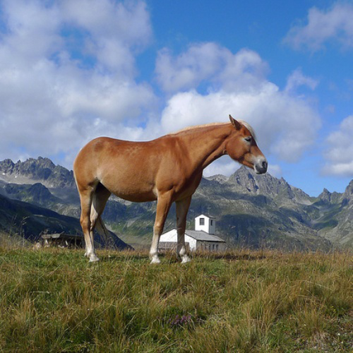

<h1 align="center">UltraEdit</h1>

<p align="center">

<a href="https://arxiv.org/abs/2407.05282">
</a>

<a href="https://huggingface.co/spaces/jeasinema/UltraEdit-SD3">
    
</a>

<a href="https://huggingface.co/datasets/BleachNick/UltraEdit">
    
</a>

<a href="https://ultra-editing.github.io/">
    
</a>

<a href="https://huggingface.co/BleachNick/SD3_UltraEdit_w_mask">
    
</a>

</p>

This repository contains code, models, and datasets for UltraEdit.

## Introduction
**UltraEdit**, a large-scale (~4M editing samples), automatically generated dataset for instruction-based image editing. Our key idea is to address the drawbacks in existing image editing datasets like InstructPix2Pix and MagicBrush, and provide a systematic approach to producing massive and high-quality image editing samples. 

**UltraEdit** offers several distinct advantages:  

1. It features a broader range of editing instructions by leveraging the creativity of large language models (LLMs) alongside in-context editing examples from human raters.  
2. Its data sources are based on real images, including photographs and artworks, which provide greater diversity and reduced bias compared to datasets solely generated by text-to-image models.  
3. It also supports region-based editing, enhanced by high-quality, automatically produced region annotations.  

Our experiments show that canonical diffusion-based editing baselines trained on **UltraEdit** set new records on various benchmarks. 
Our analysis further confirms the crucial role of real image anchors and region-based editing data.

## Training

**Setup:** 

```
pip install -r requirements

cd diffusers && pip install -e .
```

> If you encounter issue with latest `diffusers` package. Here is a quick tour to enable inference with **UltraEdit** (i.e., `StableDiffusion3InstructPix2PixPipeline`)

<details>
<summary>TL:DR</summary>
As we only need a new pipeline named `StableDiffusion3InstructPix2PixPipeline` to be registered in diffusers package, you can simply modify your `diffusers` source code in your env as follow:

1. Insert two single line under `/path/to/your/env/lib/your_python_version/site-packages/diffusers/__init__.py`

```python
_import_structure["pipelines"].extend(
    [
    "StableDiffusion3Img2ImgPipeline",     # existing pipelines
    "StableDiffusion3InpaintPipeline",     # existing pipelines
    "StableDiffusion3InstructPix2PixPipeline", # add this
    ]
)

## exisitng code ##
from .pipelines import (
    StableDiffusion3Img2ImgPipeline,     # existing pipelines
    StableDiffusion3InpaintPipeline,     # existing pipelines
    StableDiffusion3InstructPix2PixPipeline, # add this line
)
```
2. Insert two single line under `/path/to/your/env/lib/your_python_version/site-packages/diffusers/pipelines/__init__.py`

```python
_import_structure["stable_diffusion_3"] = [
    "StableDiffusion3Pipeline",  # existing pipelines
    "StableDiffusion3Img2ImgPipeline",  # existing pipelines
    "StableDiffusion3InpaintPipeline",  # existing pipelines
    "StableDiffusion3InstructPix2PixPipeline", # add this line
]

## exisitng code ##

from .stable_diffusion_3 import (
    StableDiffusion3Img2ImgPipeline, # existing pipelines
    StableDiffusion3InpaintPipeline, # existing pipelines
    StableDiffusion3Pipeline, # existing pipelines
    StableDiffusion3InstructPix2PixPipeline, # add this line
    )
```

3. Copy file `UltralEdit/src/diffusers/pipelines/stable_diffusion_3/pipeline_stable_diffusion_3_instructpix2pix.py` to `/path/to/your/env/lib/your_python_version/site-packages/diffusers/pipelines/stable_diffusion_3/pipeline_stable_diffusion_3_instructpix2pix.py`

4. Insert two single line under `/path/to/your/env/lib/your_python_version/site-packages/diffusers/pipelines/stable_diffusion_3/__init__.py`

```python
else:
    _import_structure["pipeline_stable_diffusion_3"] = ["StableDiffusion3Pipeline"]
    _import_structure["pipeline_stable_diffusion_3_img2img"] = ["StableDiffusion3Img2ImgPipeline"]
    _import_structure["pipeline_stable_diffusion_3_inpaint"] = ["StableDiffusion3InpaintPipeline"]
    _import_structure["pipeline_stable_diffusion_3_instructpix2pix"] = ["StableDiffusion3InstructPix2PixPipeline"] # add this line

## exisitng code ##

from .pipeline_stable_diffusion_3 import StableDiffusion3Pipeline
from .pipeline_stable_diffusion_3_img2img import StableDiffusion3Img2ImgPipeline
from .pipeline_stable_diffusion_3_inpaint import StableDiffusion3InpaintPipeline
from .pipeline_stable_diffusion_3_instructpix2pix import StableDiffusion3InstructPix2PixPipeline # add this line
```
Okay, done it! Please especially pay attention to indent (where we highly recommend using python auto format check while editing), otherwise you may encounter indent error.

</details>

### Training with stable-diffusion3

**Stage 1: Free-form image editing**

```shell
bash scripts/run_sft_512_sd3_stage1.sh
```

**Stage 2: Mix training**

```shell
bash scripts/run_sft_512_with_mask_sd3_stage2.sh
```

### Training with stable-diffusion-xl

**Stage 1: Free-form image editing**

```shell
bash scripts/run_sft_512_sdxl_stage1.sh
```

[//]: # (**Stage 2: Mix training**)

[//]: # ()
[//]: # (```shell)

[//]: # (bash scripts/run_sft_512_with_mask_sd3_stage2.sh)

[//]: # (```)


### Training with stable-diffusion1.5

**Stage 1: Free-form image editing**

```shell
bash scripts/run_sft_512_sd15_stage1.sh
```

**Stage 2: Mix training**

```shell
bash scripts/run_sft_512_with_mask_sd15_stage2.sh
```

## Example
Below is an example of how to use our pipeline for image editing. Given an input image and a mask image, the model can generate the edited result according to the provided prompt.

<p float="left">
  
  
  
</p>

```python
# For Editing with SD3
import torch
from diffusers import StableDiffusion3InstructPix2PixPipeline
from diffusers.utils import load_image
import requests
import PIL.Image
import PIL.ImageOps
pipe = StableDiffusion3InstructPix2PixPipeline.from_pretrained("BleachNick/SD3_UltraEdit_w_mask", torch_dtype=torch.float16)
pipe = pipe.to("cuda")
prompt="What if the horse wears a hat?"
img = load_image("input.png").resize((512, 512))
mask_img = load_image("mask_img.png").resize(img.size)
# For free form Editing, seed a blank mask
# mask_img = PIL.Image.new("RGB", img.size, (255, 255, 255))
image = pipe(
    prompt,
    image=img,
    mask_img=mask_img,
    negative_prompt="",
    num_inference_steps=50,
    image_guidance_scale=1.5,
    guidance_scale=7.5,
).images[0]
image.save("edited_image.png")
# display image
```
## Citation

If you find our work useful, please kindly cite
```bib
@misc{zhao2024ultraeditinstructionbasedfinegrainedimage,
      title={UltraEdit: Instruction-based Fine-Grained Image Editing at Scale}, 
      author={Haozhe Zhao and Xiaojian Ma and Liang Chen and Shuzheng Si and Rujie Wu and Kaikai An and Peiyu Yu and Minjia Zhang and Qing Li and Baobao Chang},
      year={2024},
      eprint={2407.05282},
      archivePrefix={arXiv},
      primaryClass={cs.CV},
      url={https://arxiv.org/abs/2407.05282}, 
}
```

[//]: # ()
[//]: # (## License)

[//]: # ()
[//]: # (This project is licensed under the terms of the MIT license. See the [LICENSE]&#40;LICENSE.md&#41; file for details.)

[//]: # ()
[//]: # (## Contact)

[//]: # ()
[//]: # (For any questions or issues, please open an issue on GitHub or contact us at support@example.com.)
